# 🎮 MULTI GAMES GUAU!

Un proyecto de videojuegos desarrollado en **Godot Engine 4.6** que reúne 8 juegos clásicos en un solo lugar.

**[Jugar aquí](https://aitorcm07.github.io/Pagina-Web-MULTI-GAMES-GUAU/)**

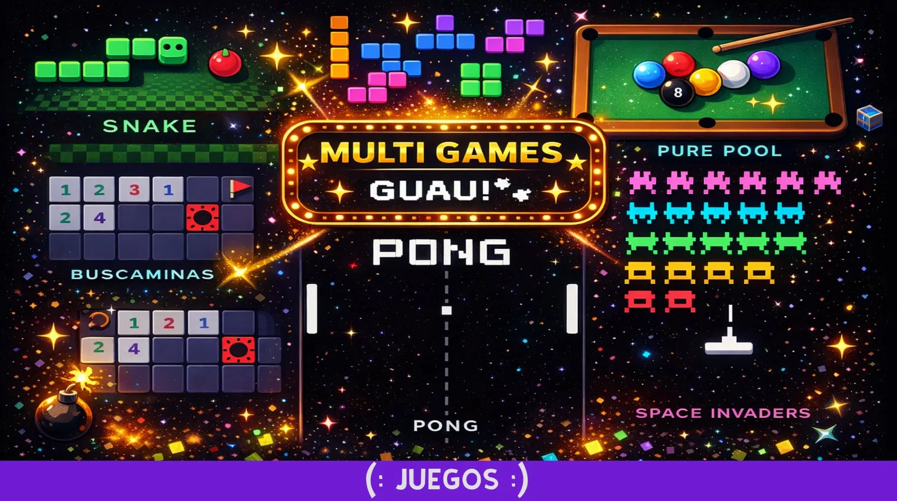
---

## **Descripción:**

MULTI GAMES GUAU! es una colección de 8 minijuegos clásicos recreados desde cero usando Godot Engine y GDScript. El proyecto incluye un sistema de puntuaciones compartido entre todos los juegos y una pantalla de selección de juegos central.
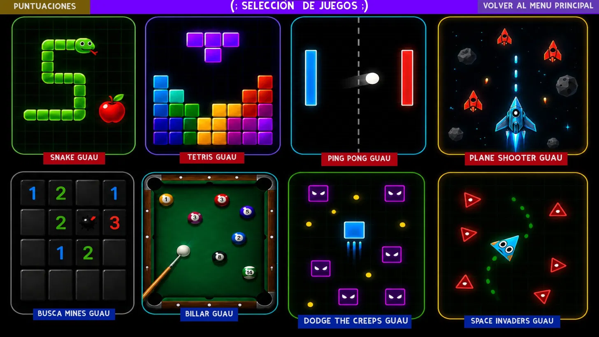

---

## **🕹️ Juegos incluidos 🕹️**

| *Juego* | *Descripción* |
|-------|-------------|
| 🐍 Snake Guau | Come manzanas y crece sin chocarte |
| 🧱 Tetris Guau | Encaja piezas y completa líneas |
| 🎱 Billar Guau | Mete todas las bolas con el menor número de golpes |
| 🏓 Ping Pong Guau | Duelo de paletas para 2 jugadores |
| 👾 Space Invaders Guau | Elimina oleadas de enemigos alienígenas |
| ✈️ Plane Shooter Guau | Destruye enemigos con tu nave |
| 🎮 Dodge the Creeps | Esquiva criaturas el mayor tiempo posible |
| 💣 Busca Minas Guau | Descubre casillas sin pisar ninguna mina |

---

## ***Cómo se ha hecho:***

- ***Motor:*** Godot Engine 4.6
- ***Lenguaje:*** GDScript
- ***Sistema de puntuaciones:*** Autoload global (`Puntuacion.gd`) que guarda las mejores puntuaciones de cada juego
- ***Exportación:*** HTML5 para jugar en el navegador

---

## **🎮 Controles 🎮**

## ***Snake***
- **Flechas** o **WASD** — mover la serpiente
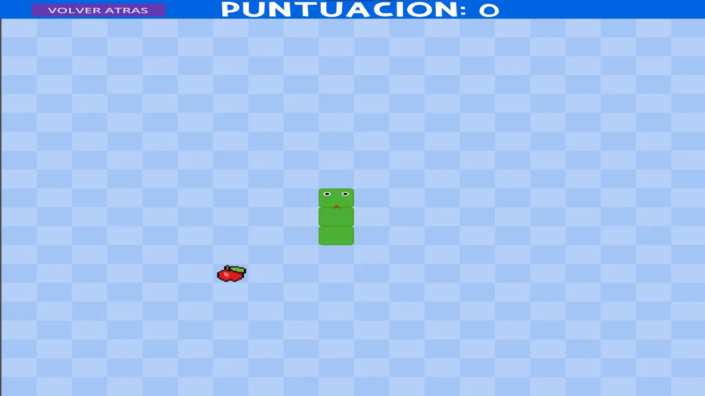

## ***Tetris***
- **A/D** — mover pieza izquierda/derecha
- **S** — bajar pieza más rápido
- **W** — rotar pieza
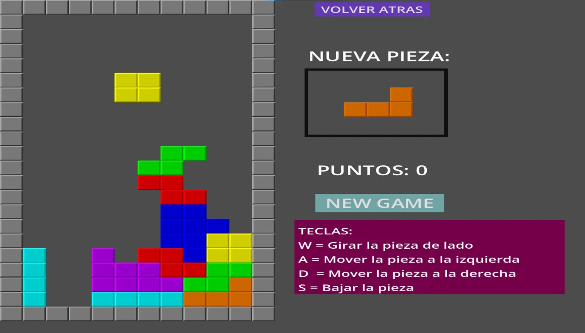

## ***Billar***
- **Ratón** — apuntar
- **Click izquierdo** — cargar y disparar
- **ESC** — volver al menú
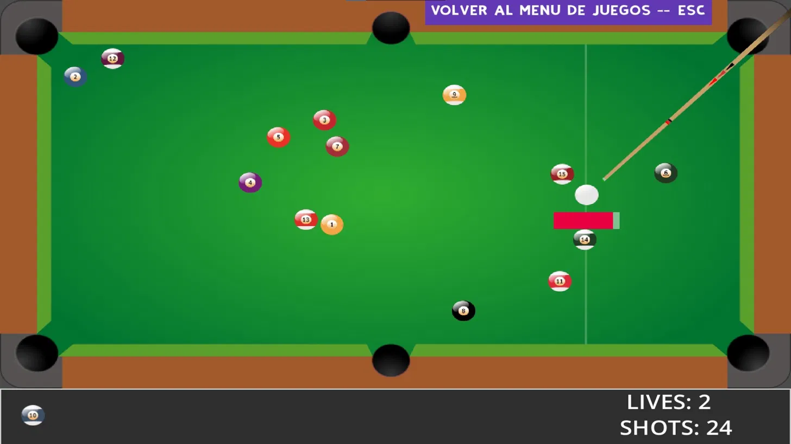

## ***Ping Pong***
- **Jugador 1 (rojo):** W/S
- **Jugador 2 (azul):** ↑/↓
- **ESC** — volver al menú
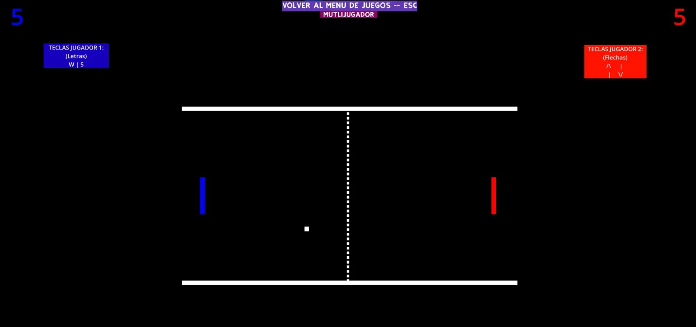

## ***Space Invaders***
- **WASD** — mover
- **Click izquierdo** — disparar
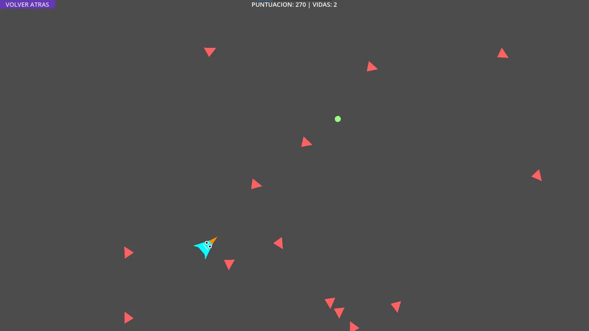

## ***Plane Shooter***
- **RATON** — Presionando la nave para poder moverla
- **ESPACIO** — Pulsar para disparar
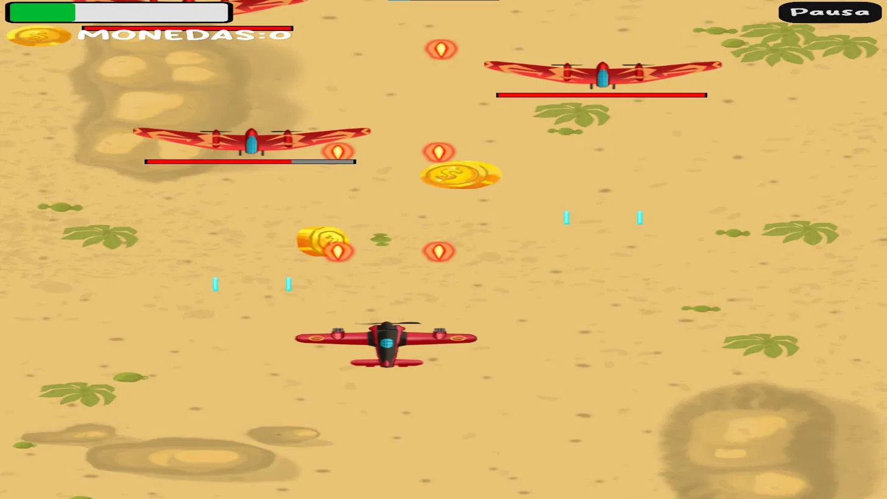

### ***Dodge the Creeps****
- **Flechas** o **WASD** — mover personaje
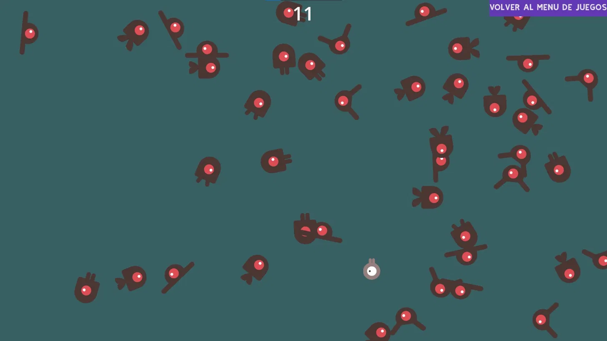

### ****Busca Minas****
- **Click izquierdo** — descubrir casilla
- **Click derecho** — poner bandera
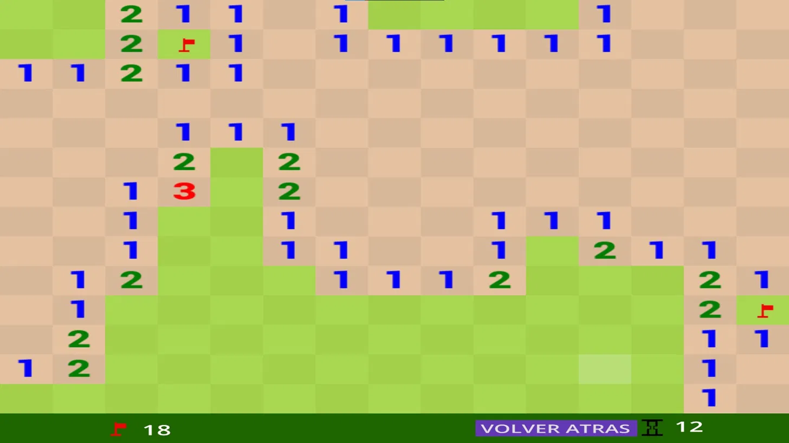

---

## ***Sistema de puntuaciones***
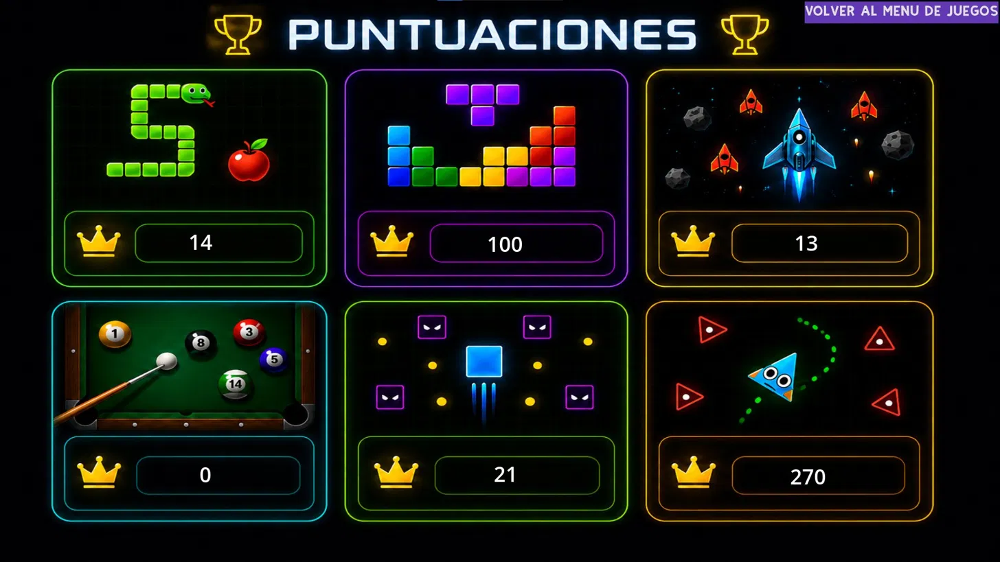

Cada juego guarda su mejor puntuación:
- 🐍 Snake — manzanas comidas
- 🧱 Tetris — puntos conseguidos
- ✈️ Plane Shooter — monedas recogidas
- 👾 Space Invaders — enemigos eliminados
- 🎮 Dodge the Creeps — tiempo sobrevivido
- 🎱 Billar — menor número de golpes

---
